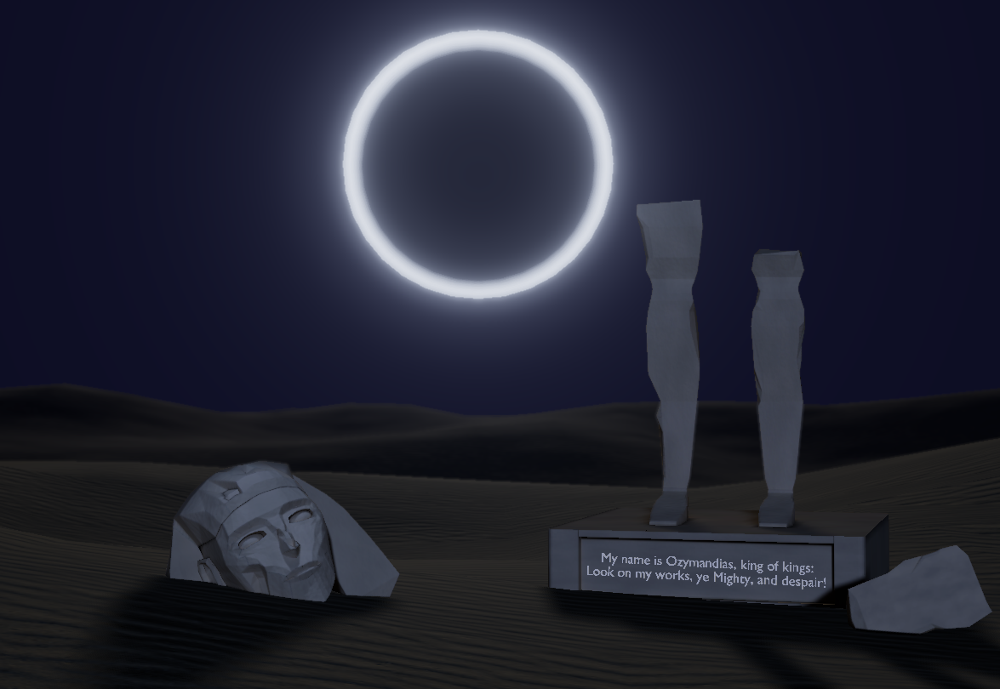

# Ozymandias

[Description](#description) • [Controls](#controls) • [Tech Stack](#techstack) • [About](#about) • [Visuals](#visuals) • [Installation](#installation)

## Description

An interactive visual interpretation of Percy Bysshe Shelley's
"Ozymandias".

The project combines a real-time 3D environment with the original
poem, voice narration, and atmospheric visual effects.

## Controls

- **W A S D** — move
- **Mouse** — look around
- **Space** — move up
- **Ctrl** — move down
- **Shift** — move faster
- **Esc** — pause the narration and release the mouse

## Tech Stack

- JavaScript
- Three.js
- WebGL
- Blender
- GLTF / GLB
- GLSL shaders

## About

The scene was created in Blender and exported to Three.js.

The main focus of the project was to preserve the visual atmosphere
of the original Blender scene while turning it into an interactive
web experience.

The user can freely explore the desert while the poem is being
narrated. There is no fixed camera path — the scene is intended to
be explored at the user's own pace.

## Visuals



## Installation

Clone the repository

```bash
git clone https://github.com/Woefulking/Ozimandias.git
cd Ozimandias
```

Install dependencies

```bash
npm install
```

Run the project

```bash
npm run dev
```
